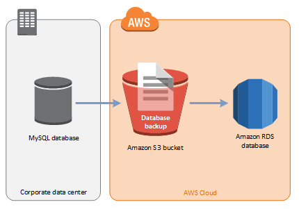
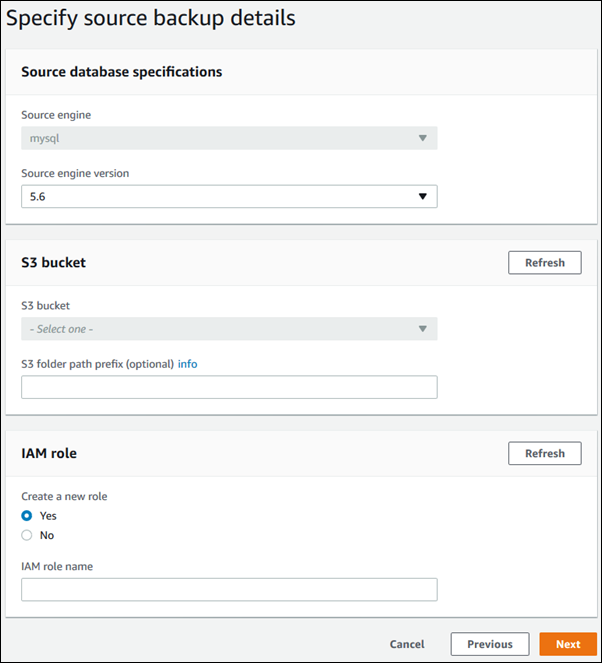

### Amazon RDS MySQL DB 인스턴스로 백업 복원
Amazon RDS는 백업 파일을 사용하여 MySQL 데이터베이스 가져오기를 지원합니다. 온-프레미스 데이터베이스의 백업을 만들어 Amazon S3에 저장한 다음 백업 파일을 MySQL을 실행하는 새로운 Amazon RDS DB 인스턴스로 복원할 수 있습니다.

다음 다이어그램에서 지원되는 시나리오를 찾을 수 있습니다.



**Amazon S3에서 백업 파일 가져오기는 MySQL 버전 5.6에서 지원됩니다.**

Amazon S3에서 백업 파일 가져오기는 모든 AWS 지역에서 사용할 수 있습니다.

백업 파일을 작성, 복사 및 복원하는 동안 데이터베이스가 오프라인일 수 있는 경우 백업 파일을 사용하여 Amazon RDS로 데이터베이스를 가져오는 것이 좋습니다. 온-프레미스 데이터베이스를 오프라인으로 설정할 수 없는 경우, 이 항목에서 설명한대로 Amazon S3를 통해 Amazon RDS로 마이그레이션 한 후, binlog 복제를 사용하여 데이터베이스를 업데이트 할 수 있습니다.

자세한 내용은 [Amazon RDS 외부에서 실행되는 MySQL 또는 MariaDB 인스턴스로 복제](https://docs.aws.amazon.com/AmazonRDS/latest/UserGuide/MySQL.Procedural.Importing.External.Repl.html)를 참조하십시오.

AWS Database Migration Service를 사용하여 데이터베이스를 Amazon RDS로 마이그레이션 할 수도 있습니다. 자세한 내용은 다음을 참조하십시오.

AWS Database Migration Service 란 무엇입니까?
(https://docs.aws.amazon.com/dms/latest/userguide/Welcome.html)

Amazon S3에서 Amazon RDS로 백업 파일 가져 오기에 대한 제한 사항 및 권장 사항

**다음은 Amazon S3에서 백업 파일을 가져오기 위한 몇 가지 제한 사항 및 권장 사항입니다.**

- 기존 DB 인스턴스가 아닌 `새 DB인스턴스로만` 데이터를 가져올 수 있습니다.

- 온-프레미스 데이터베이스의 백업을 생성하려면 `Percona XtraBackup`을 사용해야 합니다.

- ``기본 MySQL 데이터 디렉토리 외부에 정의된 테이블이 있는 소스 데이터베이스에서 마이그레이션할 수 없습니다.``

- `` MySQL 5.5 또는 5.7 데이터베이스는 가져올 수 없습니다.``

- 사내 구축형 MySQL 5.6 데이터베이스를 `Amazon RDS MySQL 5.7 데이터베이스로 가져올 수 없습니다.` 가져오기를 완료한 후 DB 인스턴스를 업그레이드 할 수 있습니다.

- 6TB보다 큰 데이터베이스는 복원할 수 없습니다.

- 암호화된 원본 데이터베이스에서 복원 할 수는 없지만 암호화 된 Amazon RDS DB 인스턴스로 복원할 수는 있습니다.

- Amazon S3 버킷을 암호화할 수 없습니다.

- **`Amazon RDS DB 인스턴스와 다른 AWS Region의 Amazon S3 버킷에서 복원 할 수 없습니다.`**

- Amazon S3에서 가져오기는 `db.t2.micro DB 인스턴스 클래스에서 지원되지 않습니다.` 그러나 다른 DB 인스턴스 클래스로 복원한 다음, 나중에 인스턴스 클래스를 변경할 수 있습니다. 인스턴스 클래스에 대한 자세한 내용은 [사용 가능한 모든 DB 인스턴스 클래스에 대한 사양을 참조하십시오.](https://docs.aws.amazon.com/AmazonRDS/latest/UserGuide/Concepts.DBInstanceClass.html#Concepts.DBInstanceClass.Summary)

- Amazon S3는 Amazon S3 버킷에 업로드되는 파일의 크기를 5TB로 제한합니다. 백업 파일이 5TB를 초과하는 경우, 백업 파일을 더 작은 파일로 분할해야 합니다.

- Amazon RDS는 Amazon S3 버킷에 업로드되는 파일의 수를 1백만개로 제한합니다. 모든 전체 및 증분 백업을 포함하여 데이터베이스의 백업 데이터가 1​​백만개의 파일을 초과하는 경우 tarball (.tar.gz) 파일을 사용하여 전체 및 증분 백업 파일을 Amazon S3 버킷에 저장하십시오.

- 사용자 계정은 자동으로 가져오기 되지 않습니다. 소스 데이터베이스에서 사용자 계정을 저장하고, 나중에 새 DB 인스턴스에 추가하십시오.

- Function은 자동으로 가져오기 되지 않습니다. 소스 데이터베이스에서 Function를 저장하고 나중에 새 DB 인스턴스에 추가하십시오.

- Stored Procedure는 자동으로 가져오기 되지 않습니다. 소스 데이터베이스에서 Stored Procedure를 저장하고 나중에 새 DB 인스턴스에 저장 프로시저를 추가하십시오.

- Time zone information는 자동으로 가져오지 않습니다. 원본 데이터베이스의 Time zone information를 기록하고 나중에 새 DB 인스턴스의 표준 시간대를 설정하십시오. 자세한 내용 은 [MySQL DB 인스턴스의 현지 표준 시간대를 참조하십시오](https://docs.aws.amazon.com/AmazonRDS/latest/UserGuide/CHAP_MySQL.html#MySQL.Concepts.LocalTimeZone).

- Backward migration은 major versions과 minor versions 모두에서 지원되지 않습니다. 예를 들어, 버전 5.7에서 버전 5.6으로 마이그레이션할 수 없으며 버전 5.6.39에서 버전 5.6.37로 마이그레이션할 수 없습니다.

**Amazon S3에서 Amazon RDS로 백업 파일 가져오기 설정 개요**

다음은 Amazon S3에서 Amazon RDS로 백업 파일을 가져오기 위해 설정해야 하는 구성요소입니다.

- 백업 파일을 저장하는 Amazon S3 버킷.

- Percona XtraBackup에서 만든 온-프레미스 데이터베이스의 백업.

- Amazon RDS가 버킷에 액세스할 수있게 해주는 AWS Identity and Access Management(IAM) 역할.

Amazon S3 버킷이 이미 있는 경우 사용할 수 있습니다. Amazon S3 버킷이 없으면 새로 만들 수 있습니다. Amazon S3 버킷을 암호화 할 수 없습니다. 새 버킷을 만들려면 [버킷 만들기](https://docs.aws.amazon.com/AmazonS3/latest/user-guide/CreatingaBucket.html)를 참조하십시오 .

Use the Percona XtraBackup tool to create your backup. For more information, see [Creating Your Database Backup](https://docs.aws.amazon.com/AmazonRDS/latest/UserGuide/MySQL.Procedural.Importing.html#MySQL.Procedural.Importing.Backup).

이미 IAM 역할이 있는 경우, 이를 사용할 수 있습니다. IAM 역할이 없으면 수동으로 새 역할을 만들 수 있습니다. 또는 AWS Management Console을 사용하여 데이터베이스를 복원 할 때 마법사가 계정에 새 IAM 역할을 만들도록 선택할 수 있습니다. 새 IAM 역할을 수동으로 만들거나 기존 IAM 역할에 신뢰 및 권한 정책을 첨부하려면 [수동으로 IAM 역할 만들기](https://docs.aws.amazon.com/AmazonRDS/latest/UserGuide/MySQL.Procedural.Importing.html#MySQL.Procedural.Importing.Enabling.IAM)를 참조하십시오.
새로운 IAM 역할을 생성하려면 [AWS Management Console](https://docs.aws.amazon.com/AmazonRDS/latest/UserGuide/MySQL.Procedural.Importing.html#MySQL.Procedural.Importing.Console)의 절차를 따르십시오 .

데이터베이스 백업 생성
Percona XtraBackup 소프트웨어를 사용하여 백업을 만듭니다. Amazon RDS는 Percona XtraBackup 소프트웨어의 다음 버전으로 생성된 백업 파일을 지원합니다.

- `MySQL 5.7의 경우 Percona XtraBackup 버전 2.4 이상을 사용하십시오.`

- `MySQL 5.6의 경우 Percona XtraBackup 버전 2.3을 사용하십시오.`

Percona XtraBackup이 설치되어 있지 않은 경우 사용 가능한 최신 버전의 소프트웨어를 사용하는 것이 좋습니다. Percona XtraBackup에서 Percona XtraBackup을 다운로드 할 수 있습니다 .
(https://www.percona.com/downloads/XtraBackup/LATEST/)

Percona XtraBackup을 사용하여 MySQL 데이터베이스 파일의 전체 백업을 만들 수 있습니다. 또는 이미 Percona XtraBackup을 사용하여 MySQL 데이터베이스 파일을 백업한 경우 기존 전체 및 증분 백업 디렉토리와 파일을 업로드할 수 있습니다.

Percona XtraBackup와 데이터베이스를 백업하는 방법에 대한 자세한 내용은 Percona 웹 사이트 문서를 참고하십시오.
[Percona XtraBackup - Documentation and The xtrabackup Binary](https://www.percona.com/doc/percona-xtrabackup/LATEST/index.html)

**Percona XtraBackup으로 전체 백업 생성**

Amazon S3에서 복원할 수 있는 MySQL 데이터베이스 파일의 전체 백업을 만들려면 Percona XtraBackup 유틸리티 (xtrabackup)를 사용하여 데이터베이스를 백업하십시오.

예를 들어 다음 명령은 MySQL 데이터베이스의 백업을 만들고 폴더 /s3-restore/backup폴더에 파일을 저장 합니다.

> xtrabackup --user=<myuser> --password=<password> /s3-restore/backup

백업을 하나의 파일로 압축하려는 경우 (필요할 경우 나눌 수 있음) 다음 형식 중 하나로 백업을 저장할 수 있습니다.

- Gzip (.gz)

- tar (.tar)

- Percona xbstream (.xbstream)

다음 명령은 여러 개의 Gzip 파일로 분할된 MySQL 데이터베이스의 백업을 만듭니다.

> xtrabackup --user=<myuser> --password=<password> --stream=tar \
   /s3-restore/backup | gzip - | split -d --bytes=500MB - /s3-restore/backup/backup.tar.gz

다음 명령은 여러 개의 tar 파일로 분할 된 MySQL 데이터베이스의 백업을 생성합니다.

> xtrabackup --user=<myuser> --password=<password> --stream=tar \
   /s3-restore/backup | split -d --bytes=500MB - /s3-restore/backup/backup.tar
다음 명령은 여러 xbstream 파일로 분할 된 MySQL 데이터베이스의 백업을 만듭니다.

> xtrabackup --stream=xbstream --user=myuser --password=<password>  \
   /s3-restore/backup | split -d --bytes=500MB - /s3-restore/backup/backup.xbstream

**Percona XtraBackup의 증분 백업 사용**

Percona XtraBackup을 사용하여 MySQL 데이터베이스 파일의 전체 및 증분 백업을 수행하는 경우 전체 백업을 생성하고 백업 파일을 Amazon S3에 업로드할 필요가 없습니다. 대신 기존 백업 디렉토리와 파일을 Amazon S3 버킷에 복사하여 상당한 시간을 절약할 수 있습니다. Percona XtraBackup을 사용하여 증분 백업을 만드는 방법에 대한 자세한 내용은 다음을 참고하십시오.
[Incremental Backup](https://www.percona.com/doc/percona-xtrabackup/LATEST/backup_scenarios/incremental_backup.html)

기존의 전체 및 증분 백업 파일을 Amazon S3 버킷에 복사 할 때 기본 디렉토리의 내용을 재귀 적으로 복사해야합니다. 이러한 내용에는 전체 백업과 모든 증분 백업 디렉토리 및 파일이 포함됩니다. 이 복사본은 Amazon S3 버킷의 디렉토리 구조를 보존해야합니다. Amazon RDS는 모든 파일과 디렉토리를 반복합니다. Amazon RDS는xtrabackup-checkpoints 파일을 사용하여 기본 디렉토리를 식별하고 로그 시퀀스 번호 (LSN) 범위별로 증가분 백업을 주문할 수 있습니다.

**Percona XtraBackup에 대한 백업 고려 사항**

Amazon RDS는 파일 이름을 기반으로 백업 파일을 사용합니다. .xbstreamPercona xbstream 형식을 사용하여 저장된 파일의 경우와 같이 파일 형식을 기반으로 적절한 파일 확장명으로 백업 파일의 이름을 지정합니다.

Amazon RDS는 백업 파일을 알파벳순 및 자연 순서대로 사용합니다. 명령을 split실행할 때 옵션을 사용 xtrabackup하여 백업 파일이 올바른 순서로 기록되고 이름이 지정되도록 하십시오.

Amazon RDS는 Percona XtraBackup을 사용하여 생성된 부분 백업을 지원하지 않습니다. : 당신은 때 다시 원본 파일을 백업 데이터베이스에 대한 부분 백업을 만들려면 다음 옵션을 사용할 수 없습니다.
 --tables, --tables-exclude, --tables-file, --databases, --databases-exclude, 또는 --databases-file.

Amazon RDS는 Percona XtraBackup을 사용하여 생성된 증분 백업을 지원합니다. Percona XtraBackup을 사용하여 증분 백업을 만드는 방법에 대한 자세한 내용은 다음을 참고하십시오.
[Incremental Backup](https://www.percona.com/doc/percona-xtrabackup/LATEST/backup_scenarios/incremental_backup.html)

**수동으로 IAM 역할 생성**

IAM 역할이 없으면 수동으로 새 역할을 만들 수 있습니다. 또는 AWS Management Console을 사용하여 데이터베이스를 복원 할 때 마법사에서 새 IAM 역할을 생성하도록 선택할 수 있습니다. 새로운 IAM 역할을 생성하려면 AWS Management Console 의 절차를 따르십시오 .

Amazon S3에서 데이터베이스를 가져 오기위한 새로운 IAM 역할을 수동으로 만들려면 Amazon Root에서 Amazon S3 버킷으로 권한을 위임하는 역할을 만드십시오. IAM 역할을 만들 때 신뢰 및 권한 정책을 첨부합니다. Amazon S3에서 백업 파일을 가져 오려면 다음 예제와 유사한 신뢰 및 권한 정책을 사용하십시오. 역할 만들기에 대한 자세한 내용은 AWS 서비스에 권한 위임을 위한 역할 만들기를 참조하십시오 .

또는 AWS Management Console을 사용하여 데이터베이스를 복원 할 때 마법사에서 새 IAM 역할을 생성하도록 선택할 수 있습니다. 새로운 IAM 역할을 생성하려면 AWS Management Console 의 절차를 따르십시오.

신뢰 및 사용 권한 정책을 사용하려면 Amazon Resource Name (ARN)을 제공해야합니다. ARN 형식에 대한 자세한 내용은 [Amazon Resource Name (ARN) 및 AWS Service Namespaces](https://docs.aws.amazon.com/general/latest/gr/aws-arns-and-namespaces.html)를 참조하십시오 .

Amazon S3에서 가져오기에 대한 신뢰 정책의 예

```
{
    "Version": "2012-10-17",
    "Statement":
    [{
        "Effect": "Allow",
        "Principal": {"Service":  "rds.amazonaws.com"},
        "Action": "sts:AssumeRole"
    }]
}
```

Amazon S3에서 가져 오기를위한 권한 정책의 예 - IAM 사용자 권한

```
{
    "Version":"2012-10-17",
    "Statement":
    [
        {
            "Sid":"AllowS3AccessRole",
            "Effect":"Allow",
            "Action":"iam:PassRole",
            "Resource":"arn:aws:iam::IAM User ID:role/S3Access"
        }
    ]
}
```

Amazon S3에서 가져 오기를위한 권한 정책의 예 - 역할 권한

```
{
    "Version": "2012-10-17",
    "Statement":
    [
        {
        "Effect": "Allow",
        "Action":
            [
                "s3:ListBucket",
                "s3:GetBucketLocation"
            ],
        "Resource": "arn:aws:s3:::bucket_name"
        },
        {
        "Effect": "Allow",
        "Action":
            [
                "s3:GetObject"
            ],
        "Resource": "arn:aws:s3:::bucket_name/prefix*"
        }
    ]
}
```

노트
파일 이름 접두사를 포함하는 경우 접두어 뒤에 별표*를 포함하십시오. 접 두부를 지정하지 않으려면 별표만 지정하십시오.

**AWS 관리 콘솔**

1. Amazon S3에서 새로운 MySQL DB 인스턴스로 데이터를 가져 오려면 AWS Management Console에 로그인하고 https://console.aws.amazon.com/rds/ 에서 Amazon RDS 콘솔을 엽니다.

2. **Amazon RDS 콘솔의 오른쪽 상단에서 DB 인스턴스를 만들 AWS 지역을 선택하십시오. 데이터베이스 백업이 포함된 Amazon S3 버킷과 동일한 AWS Region을 선택하십시오.**

3. 탐색 창에서 인스턴스를 선택하십시오.

4. S3 에서 복원을 선택하여 마법사를 시작하십시오.

5. 마법사가 엔진 선택 페이지 에서 열립니다.
선택 엔진 페이지에서 MySQL의 아이콘을 선택한고, 다음을 선택하면 지정 소스 백업 세부 정보 페이지가 나타납니다.

                        

6. 원본 데이터베이스 백업에 대한 세부 정보를 지정하는 페이지

a. For Source engine, choose mysql.

b. For Source engine version, choose the MySQL version of your source database.

c. For S3 bucket, choose your Amazon S3 bucket.

d. (선택사항) S3 폴더 경로 접두사의 경우, Amazon S3 버킷에 저장된 파일의 파일 경로 접두사를 입력하십시오. 접두사를 지정하지 않으면 RDS는 S3 버킷의 루트 폴더에 있는 모든 파일과 폴더를 사용하여 DB 인스턴스를 만듭니다. 접두사를 지정하면 RDS는 파일 경로가 지정된 접두어로 시작되는 S3 버킷의 파일과 폴더를 사용하여 DB 인스턴스를 만듭니다. 예를 들어, 백업 파일을 S3의 하위 폴더에 backups라는 이름으로 저장하고 여러 개의 백업 파일 세트가 있는 경우, 각각은 자체 디렉토리에 있습니다 (gzip_backup1, gzip_backup2 등). 이 경우 gzip_backup1 폴더의 파일에서 복원 할 backups / gzip_backup1 접두어를 지정합니다.

e. 새 역할 작성을 위해 선택하지 예를 계정에 새로운 IAM 역할을 만들거나 선택할 수 없음을 기존 IAM 역할을 선택할 수 있습니다.

f. 들어 IAM 역할 , 기존 IAM 역할을 선택하거나 새 IAM 역할의 이름을 지정합니다. 새 역할 만들기에서 예 를 선택하여 새 IAM 역할을 만들도록 선택할 수 있습니다.

7. 계속 하려면 다음 을 선택하십시오. DB 세부 사항을 지정 페이지가 나타납니다.

상의 지정 DB 정보 페이지, 사용자의 DB 인스턴스 정보를 지정합니다. 각 설정에 대한 자세한 내용은 MySQL DB 인스턴스 설정을 참조하십시오 .

노트

새 DB 인스턴스에 충분한 메모리를 할당하여 복원이 성공할 수 있도록하십시오. 향후 성장을 위해 추가 메모리를 할당 할 수도 있습니다.

8. 계속 하려면 다음 을 선택하십시오 . 구성 고급 설정 페이지가 나타납니다.

Amazon RDS가 DB 인스턴스를 시작하는 데 필요한 추가 정보를 제공하십시오. 각 설정에 대한 자세한 내용은 MySQL DB 인스턴스 설정을 참조하십시오 .

9. Launch DB instance를 선택합니다.

CLI
AWS CLI를 사용하여 Amazon S3에서 새 MySQL DB 인스턴스로 데이터를 가져 오려면 다음과 같은 매개 변수 를 사용하여 restore-db-instance-from-s3 명령을 호출하십시오 . 각 설정에 대한 자세한 내용은 MySQL DB 인스턴스 설정을 참조하십시오 .

노트

새 DB 인스턴스에 충분한 메모리를 할당하여 복원이 성공할 수 있도록하십시오. 향후 성장을 위해 추가 메모리를 할당 할 수도 있습니다.

- --allocated-storage
- --db-instance-identifier
- --db-instance-class
- --engine
- --master-user-name
- --master-user-password
- --s3-bucket-name
- --s3-ingestion-role-arn
- --s3-prefix
- --source-engine
- --source-engine-version

예

Linux, OS X 또는 Unix의 경우 :
```
aws rds restore-db-instance-from-s3 \  
--allocated-storage 250 \
--db-instance-identifier myidentifier \
--db-instance-class db.m4.large \
--engine mysql \
--master-user-name masterawsuser \
--master-user-password masteruserpassword \
--s3-bucket-name mybucket \
--s3-ingestion-role-arn arn:aws:iam::account-number:role/rolename \
--s3-prefix bucketprefix \
--source-engine mysql \
--source-engine-version 5.6.40
```

Windows의 경우 :

```
aws rds restore-db-instance-from-s3 ^
--allocated-storage 250 ^
--db-instance-identifier myidentifier ^
--db-instance-class db.m4.large ^
--engine mysql ^
--master-user-name masterawsuser ^
--master-user-password masteruserpassword ^
--s3-bucket-name mybucket ^
--s3-ingestion-role-arn arn:aws:iam::account-number:role/rolename ^
--s3-prefix bucketprefix ^
--source-engine mysql ^
--source-engine-version 5.6.40
```

API
Amazon RDS API를 사용하여 Amazon S3에서 새로운 MySQL DB 인스턴스로 데이터를 가져 오려면 [RestoreDBInstanceFromS3](https://docs.aws.amazon.com/AmazonRDS/latest/APIReference/API_RestoreDBInstanceFromS3.html) 작업을 호출하십시오 .

관련 주제

[MySQL DB 인스턴스로 데이터 가져오기](https://docs.aws.amazon.com/AmazonRDS/latest/UserGuide/MySQL.Procedural.Importing.Other.html)

[Amazon RDS DB 인스턴스 백업 및 복원](https://docs.aws.amazon.com/AmazonRDS/latest/UserGuide/CHAP_CommonTasks.BackupRestore.html)
